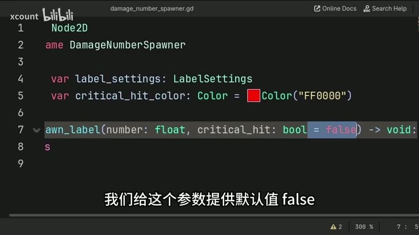

# 【Godot教程】伤害数字生成器：暴击变色、随机漂浮、可复用，一看就会

> UP主: xcount | 时长: 00:02:00 | 原视频: https://www.bilibili.com/video/BV1C9QCBdE1U

## 这个教程做什么
创建一个伤害数字生成器

## 目录
1. [下载教程资源](#s1)
2. [创建自定义节点](#s2)
3. [定义类名和导出变量](#s3)
4. [设置标签属性](#s4)
5. [创建生成标签函数](#s5)
6. [定义标签文本和颜色](#s6)

## 步骤详解

<a id="s1"></a>
## 下载教程资源

[00:00:00] **下载 R 场景文件**

你可以在视频描述中找到免费的 R 场景文件下载链接。点击链接即可下载所需的资源。


*为什么这么做*: 下载这些资源可以帮助你在后续的教程中进行实践，确保你能够跟上每个步骤。

<a id="s2"></a>
## 创建自定义节点

[00:00:06] **新建自定义节点**

在本步骤中，你将创建一个自定义节点，以便在游戏中添加简单的伤害数字。这个节点将包含生成伤害数字标签的所有逻辑。


*为什么这么做*: 创建自定义节点可以让你在游戏中轻松地添加和管理伤害数字，提升游戏的可玩性和反馈效果。

[00:00:12] **命名脚本**

接下来，前往 `Scripts` 选项卡，点击 `File` 菜单，选择 `New Script`。在弹出的对话框中，将新脚本命名为 `Damage Number Spawner`，然后点击 `Create` 按钮。


*为什么这么做*: 通过命名脚本为 `Damage Number Spawner`，你可以清晰地识别这个脚本的功能，便于后续的维护和使用。

### 本节完整代码

```gdscript
# 这里是创建的 Damage Number Spawner 脚本的初始代码
extends Node

# 这里可以添加后续的逻辑代码
```

<a id="s3"></a>
## 定义类名和导出变量

[00:00:18] **扩展 Node2D**

在这一步中，你需要确保脚本扩展 `Node2D`。这将使得自定义节点具备 `Node2D` 的所有属性，包括位置值，这样你就可以在场景中自由地放置这个节点。


*为什么这么做*: 通过扩展 `Node2D`，你可以利用其位置属性来控制伤害数字的显示位置。

[00:00:29] **定义类名**

接下来，定义类名为 `DamageNumberSpawner`。这将使得脚本在添加节点窗口中显示为一个自定义节点，方便你在场景中添加和查找。


*为什么这么做*: 通过定义类名为 `DamageNumberSpawner`，你可以清晰地识别这个节点的功能，确保在需要时能够快速找到它。

[00:00:37] **导出变量**

现在，你需要在脚本中定义两个导出变量。第一个变量是 `damageLabel`，类型为 `Label`，用于显示伤害数字；第二个变量是 `labelColor`，类型为 `Color`，用于设置伤害数字的颜色。你可以使用以下代码来实现：

```gdscript
@export var damageLabel: Label
@export var labelColor: Color
```

*为什么这么做*: 导出变量使得你可以在 Godot 编辑器中直接设置这些属性，从而方便地调整伤害数字的显示效果。

### 本节完整代码

```gdscript
extends Node2D

class_name DamageNumberSpawner

@export var damageLabel: Label
@export var labelColor: Color
```

<a id="s4"></a>
## 设置标签属性

[00:00:41] **定义标签设置**

在这一部分，你将设置标签的属性，以便在游戏中生成的伤害数字显示得更加美观和清晰。标签设置资源将包含字体、字体大小、字体颜色、轮廓等多种数据。

*为什么这么做*: 通过定义标签设置，你可以确保伤害数字在视觉上吸引玩家的注意，并且在不同情况下（如暴击）能够清晰地传达信息。

[00:00:45] **设置字体和颜色**

在标签设置中，你需要为字体选择合适的样式和大小，并设置默认的字体颜色。对于暴击的颜色，可以选择红色作为默认值，以便在玩家造成暴击时突出显示。

*为什么这么做*: 选择合适的字体和颜色可以提升游戏的视觉效果，使玩家更容易识别重要信息，如暴击。

### 本节完整代码

```gdscript
# 假设你已经定义了一个 LabelSettings 资源
var labelSettings = LabelSettings.new()
labelSettings.font = preload("res://path_to_your_font.tres") # 替换为你的字体资源路径
labelSettings.font_size = 24
labelSettings.font_color = Color(1, 1, 1) # 白色
labelSettings.critical_hit_color = Color(1, 0, 0) # 红色
```

<a id="s5"></a>
## 创建生成标签函数

[00:00:57] **定义生成标签函数**

在这一部分，你将创建一个名为 `spawn_label` 的自定义函数，用于生成伤害数字标签。该函数将接收两个参数：`number`（要显示的伤害值）和 `critical_hit`（指示是否为暴击的布尔值，默认为 `false`）。

*为什么这么做*: 通过定义这个函数，你可以灵活地生成不同的伤害数字标签，并根据是否为暴击来改变标签的颜色。

[00:01:08] **设置颜色选择**

在函数内部，你可以使用 `labelColor` 和 `critical_hit_color` 来设置标签的颜色。如果 `critical_hit` 为 `true`，则使用 `critical_hit_color`，否则使用 `labelColor`。这将使得不同的标签在视觉上具有不同的效果。



*为什么这么做*: 通过为暴击和普通伤害设置不同的颜色，玩家可以更直观地识别出重要的游戏信息，提升游戏体验。

[00:01:18] **添加导出变量**

确保在脚本中添加导出变量，以便在 Godot 编辑器中可以为每个生成器设置不同的标签样式。这使得不同的敌人可以有不同外观的标签，增加游戏的多样性。

*为什么这么做*: 通过允许每个生成器使用不同的标签样式，你可以为游戏中的不同角色或敌人提供独特的视觉反馈，增强游戏的趣味性。

### 本节完整代码

```gdscript
func spawn_label(number: int, critical_hit: bool = false):
    var label_color = critical_hit ? critical_hit_color : labelColor
    # 这里可以添加生成标签的逻辑
```

<a id="s6"></a>
## 定义标签文本和颜色

[00:01:42] **定义新标签变量**

在这一部分，你将定义一个名为 `new_label` 的变量，用于存储新的标签节点。这个节点将用于显示伤害数字。

*为什么这么做*: 通过创建一个新的标签节点，你可以在游戏中动态生成并显示伤害值，提升游戏的互动性和反馈效果。

[00:01:49] **设置标签文本**

接下来，你需要设置标签的文本属性。使用 `str` 函数将伤害值 `number` 转换为字符串，以便将其赋值给 `new_label` 的文本属性。这样，玩家在游戏中就能看到实际的伤害数字。

*为什么这么做*: 将数字转换为字符串是为了确保标签能够正确显示伤害值，避免出现类型错误。

[00:01:53] **设置标签的其他属性**

在设置完文本后，你还需要为 `new_label` 设置其他属性，例如字体、颜色和位置等。这些属性将决定标签在游戏中的外观和表现。

*为什么这么做*: 通过设置标签的外观属性，你可以确保伤害数字在视觉上吸引玩家的注意，并且与游戏的整体风格相匹配。

### 本节完整代码

```gdscript
func spawn_label(number: int, critical_hit: bool = false):
    var new_label = Label.new()
    new_label.text = str(number)
    # 这里可以继续设置其他属性，例如字体、颜色等
```

## 完整代码合集

```gdscript
# 这里是创建的 Damage Number Spawner 脚本的初始代码
extends Node

# 这里可以添加后续的逻辑代码
```

```gdscript
extends Node2D

class_name DamageNumberSpawner

@export var damageLabel: Label
@export var labelColor: Color
```

```gdscript
# 假设你已经定义了一个 LabelSettings 资源
var labelSettings = LabelSettings.new()
labelSettings.font = preload("res://path_to_your_font.tres") # 替换为你的字体资源路径
labelSettings.font_size = 24
labelSettings.font_color = Color(1, 1, 1) # 白色
labelSettings.critical_hit_color = Color(1, 0, 0) # 红色
```

```gdscript
func spawn_label(number: int, critical_hit: bool = false):
    var label_color = critical_hit ? critical_hit_color : labelColor
    # 这里可以添加生成标签的逻辑
```

```gdscript
func spawn_label(number: int, critical_hit: bool = false):
    var new_label = Label.new()
    new_label.text = str(number)
    # 这里可以继续设置其他属性，例如字体、颜色等
```

## 编辑备注 (polish 阶段建议, 待人工核对)

- [s2] **transition**: 和 s1 衔接突兀, 建议在 s1 结尾提到将要创建自定义节点的内容以引导 s2.
- [s4] **transition**: 和 s3 衔接突兀, 建议在 s3 结尾提到需要设置标签属性以引导 s4.
- [s5] **transition**: 和 s4 衔接突兀, 建议在 s4 结尾提到生成标签函数的必要性以引导 s5.
- [s6] **transition**: 和 s5 衔接突兀, 建议在 s5 结尾提到定义标签文本和颜色的步骤以引导 s6.