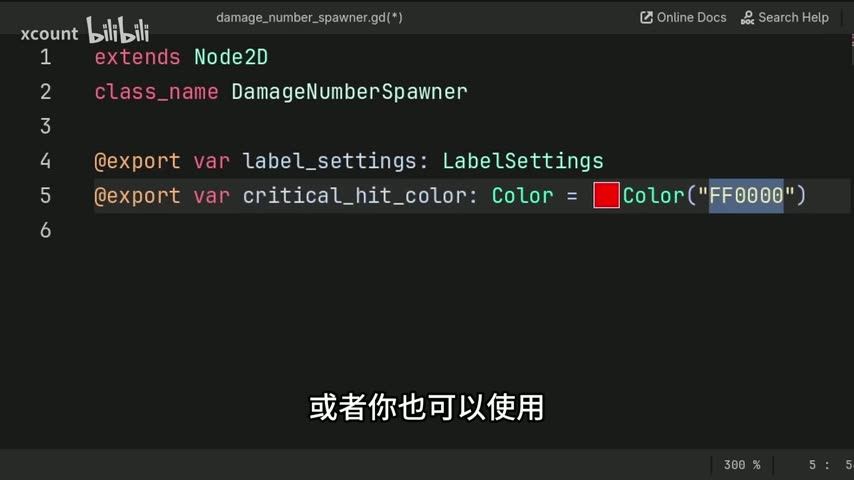

# 【Godot教程】伤害数字生成器：暴击变色、随机漂浮、可复用，一看就会

> UP主: xcount | 时长: 00:02:00 | 原视频: https://www.bilibili.com/video/BV1C9QCBdE1U

## 这个教程做什么
创建一个伤害数字生成器

## 目录
1. [下载教程资源](#s1)
2. [创建自定义节点](#s2)
3. [定义类名和导出变量](#s3)
4. [设置标签属性](#s4)
5. [创建生成标签函数](#s5)
6. [定义标签文本和颜色](#s6)

## 步骤详解

<a id="s1"></a>
## 下载教程资源

[00:00:00] **下载资源**

你可以免费下载本教程中使用的 R 场景文件，链接在视频描述中提供。


*为什么这么做*: 这样你可以直接使用示例文件进行学习和实践，节省时间并提高学习效率。

<a id="s2"></a>
## 创建自定义节点

[00:00:06] **新建自定义节点**

在本步骤中，我们将创建一个自定义节点，以便在游戏中添加简单易用的伤害数字。这个节点将包含生成伤害数字标签的所有逻辑。


*为什么这么做*: 通过创建自定义节点，我们可以更方便地在游戏中管理和显示伤害数字。

[00:00:12] **命名脚本**

接下来，转到 `Scripts` 标签，选择 `File` 菜单，然后点击 `New Script`。在弹出的对话框中，将脚本命名为 `Damage Number Spawner`，然后点击 `Create` 按钮。


*为什么这么做*: 通过命名脚本为 `Damage Number Spawner`，我们可以清晰地识别这个脚本的功能，便于后续的维护和使用。

<a id="s3"></a>
## 定义类名和导出变量

[00:00:18] **确保扩展 Node2D**

在本步骤中，我们将确保自定义节点扩展 `Node2D`。这样做的目的是为了能够使用 `Node2D` 的位置属性，从而可以在场景中灵活地放置伤害数字生成器。


*为什么这么做*: 通过扩展 `Node2D`，我们可以方便地控制节点的位置，确保伤害数字出现在我们想要的位置。

[00:00:29] **定义类名**

接下来，我们将类名定义为 `DamageNumberSpawner`。这将使得脚本成为一个可在场景中添加的节点。

```gdscript
extends Node2D

class_name DamageNumberSpawner
```

*为什么这么做*: 定义类名为 `DamageNumberSpawner` 可以让我们在添加节点时更容易找到它，并清晰地识别其功能。

[00:00:37] **导出变量**

在此步骤中，我们将定义两个导出变量。导出变量使得我们可以在编辑器中直接调整这些变量的值，而不需要修改代码。你可以使用 `@export` 关键字来定义这些变量。

```gdscript
@export var damageAmount: int
@export var lifetime: float
```

*为什么这么做*: 通过导出变量，我们可以在编辑器中方便地设置伤害值和数字的生命周期，增强了脚本的灵活性和可用性。

### 本节完整代码

```gdscript
extends Node2D

class_name DamageNumberSpawner

@export var damageAmount: int
@export var lifetime: float
```

<a id="s4"></a>
## 设置标签属性

[00:00:41] **创建标签设置变量**

在本步骤中，我们将创建一个变量来保存标签的设置。这些设置将包含我们生成的标签所需的各种属性，例如字体、字体大小和颜色等。

*为什么这么做*: 通过集中管理标签的设置，我们可以更方便地调整和修改标签的外观和行为。

[00:00:45] **定义标签设置资源**

接下来，我们需要定义一个标签设置资源。这个资源将包含多个不同的数据项，包括字体、字体大小、字体颜色、轮廓等。我们还将为关键击颜色设置一个默认值，这个颜色将在我们造成关键击时使用。

```gdscript
var labelSettings: LabelSettings
var criticalHitColor: Color = Color.red
```

*为什么这么做*: 使用资源来管理标签的设置，可以提高代码的可维护性和可读性，同时也使得在编辑器中调整这些设置变得更加直观。

[00:00:53] **设置关键击颜色**

在这一步中，我们将为关键击设置一个颜色。这里我们使用红色作为默认值，以便在造成关键击时，标签能够以显眼的颜色显示。

*为什么这么做*: 通过设置关键击颜色，我们可以让玩家更容易识别出重要的游戏事件，增强游戏的视觉反馈。

### 本节完整代码

```gdscript
var labelSettings: LabelSettings
var criticalHitColor: Color = Color.red
```

<a id="s5"></a>
## 创建生成标签函数

[00:00:57] **创建标签生成函数**

在本步骤中，你将创建一个名为 `spawn_label` 的自定义函数，用于生成伤害数字标签。这个函数将接收两个参数：`number` 表示要显示的伤害值，`critical_hit` 用于指示是否为关键击。

```gdscript
func spawn_label(number: float, critical_hit: bool = false) -> void:
	pass
```

*为什么这么做*: 通过创建这个函数，我们可以灵活地生成不同的伤害标签，并根据需要改变标签的颜色。

[00:01:00] **设置颜色变量**

在函数中，你可以使用 `Color` 类型来设置标签的颜色。你可以选择使用颜色名称或十六进制值来定义颜色。例如，使用 `Color("FF0000")` 来设置红色。



*为什么这么做*: 通过允许不同的颜色设置，你可以为不同的敌人或事件提供更直观的视觉反馈，增强游戏体验。

[00:01:08] **定义导出变量**

确保将 `label_settings` 和 `critical_hit_color` 这两个变量导出，以便在编辑器中方便地调整它们的值。这样做可以让每个生成器在游戏中拥有不同的标签外观。

```gdscript
@export var label_settings: LabelSettings
@export var critical_hit_color: Color = Color("FF0000")
```

*为什么这么做*: 导出变量使得在编辑器中调整标签的属性变得更加灵活，适应不同的游戏需求。

### 本节完整代码

```gdscript
extends Node2D

class_name DamageNumberSpawner

@export var label_settings: LabelSettings
@export var critical_hit_color: Color = Color("FF0000")

func spawn_label(number: float, critical_hit: bool = false) -> void:
	pass
```

<a id="s6"></a>
## 定义标签文本和颜色

[00:01:42] **定义新标签变量**

在这一步中，你将定义一个名为 `new_label` 的变量，用于保存新创建的标签节点。这个变量将帮助我们在后续步骤中对标签进行设置和管理。

*为什么这么做*: 通过定义一个变量来存储标签节点，我们可以在生成标签时方便地访问和修改它的属性。

[00:01:49] **设置标签属性**

接下来，你需要为 `new_label` 设置多个属性，包括文本内容、字体、颜色等。首先，将伤害值转换为字符串格式，以便将其赋值给标签的 `text` 属性。你可以使用 `str(number)` 来实现这一点。

```gdscript
var new_label = Label.new()
new_label.text = str(number)
```

*为什么这么做*: 将数字转换为字符串并设置为标签的文本内容，可以确保玩家在游戏中看到的伤害数字是清晰可读的。

[00:01:57] **设置标签颜色**

在设置完文本后，你还需要为标签指定颜色。可以根据是否为关键击来选择不同的颜色。例如，如果 `critical_hit` 参数为 `true`，则使用 `critical_hit_color`，否则使用默认颜色。

```gdscript
new_label.modulate = critical_hit ? critical_hit_color : Color.white
```

*为什么这么做*: 通过根据不同条件设置标签颜色，可以增强游戏的视觉反馈，使玩家能够快速识别重要的游戏事件。

### 本节完整代码

```gdscript
func spawn_label(number: float, critical_hit: bool = false) -> void:
    var new_label = Label.new()
    new_label.text = str(number)
    new_label.modulate = critical_hit ? critical_hit_color : Color.white
```

## 完整代码合集

```gdscript
extends Node2D

class_name DamageNumberSpawner

@export var damageAmount: int
@export var lifetime: float
```

```gdscript
var labelSettings: LabelSettings
var criticalHitColor: Color = Color.red
```

```gdscript
extends Node2D

class_name DamageNumberSpawner

@export var label_settings: LabelSettings
@export var critical_hit_color: Color = Color("FF0000")

func spawn_label(number: float, critical_hit: bool = false) -> void:
	pass
```

```gdscript
func spawn_label(number: float, critical_hit: bool = false) -> void:
    var new_label = Label.new()
    new_label.text = str(number)
    new_label.modulate = critical_hit ? critical_hit_color : Color.white
```

## 编辑备注 (polish 阶段建议, 待人工核对)

- [s2] **transition**: 和 s1 衔接突兀, 建议在 s1 结尾提到下载资源后需要进行自定义节点的创建，以便自然引入 s2。
- [s3] **transition**: 和 s2 衔接突兀, 建议在 s2 结尾提到自定义节点需要定义类名和导出变量，以便自然引入 s3。
- [s4] **transition**: 和 s3 衔接突兀, 建议在 s3 结尾提到定义类名后需要设置标签属性，以便自然引入 s4。
- [s5] **transition**: 和 s4 衔接突兀, 建议在 s4 结尾提到设置标签属性后需要创建生成标签函数，以便自然引入 s5。
- [s6] **transition**: 和 s5 衔接突兀, 建议在 s5 结尾提到生成标签后需要定义标签文本和颜色，以便自然引入 s6。