# Godot 4 伤害数字生成器：暴击变色 + 随机漂浮 + Tween 动画

> 视频作者：xcount | 时长：8:40 | 来源：[BV1C9QCBdE1U](https://www.bilibili.com/video/BV1C9QCBdE1U)
>
> 本教程实现一个可复用的 DamageNumberSpawner 自定义节点，支持暴击变色、随机漂浮动画，可添加到任意 2D 敌人身上。

---

## 1. 创建自定义节点脚本

[00:12] **新建 GDScript 文件**

打开 Godot 编辑器，进入 Script 标签页，点击 File > New Script，将脚本命名为 `damage_number_spawner.gd`，点击 Create。

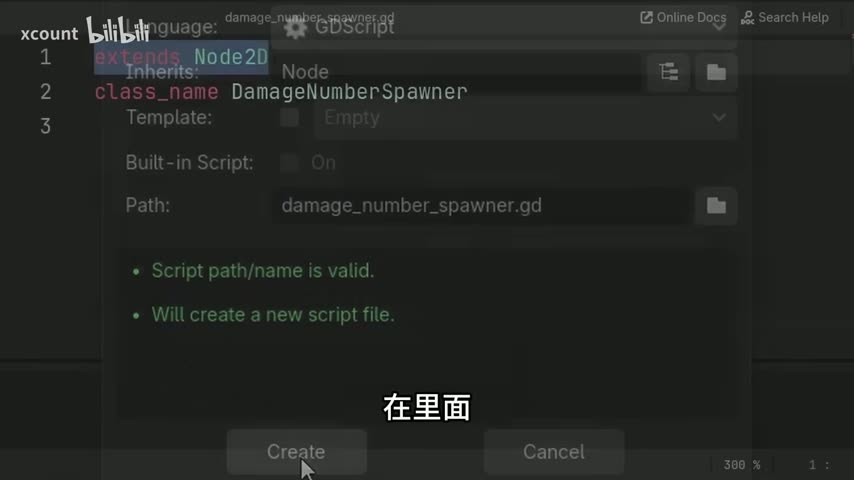

在脚本顶部声明两行：

```gdscript
extends Node2D
class_name DamageNumberSpawner
```

*为什么用 Node2D*：我们需要它的 `position` 属性，这样可以控制伤害数字的生成位置。`class_name` 会将脚本注册为自定义节点，之后可以在 Add Node 窗口中搜索 `DamageNumberSpawner` 直接添加。

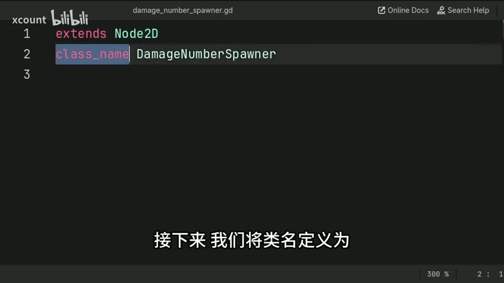

---

## 2. 声明导出变量

[00:37] **定义 label_settings 和 critical_hit_color**

```gdscript
@export var label_settings: LabelSettings
@export var critical_hit_color: Color = Color("FF0000")
```

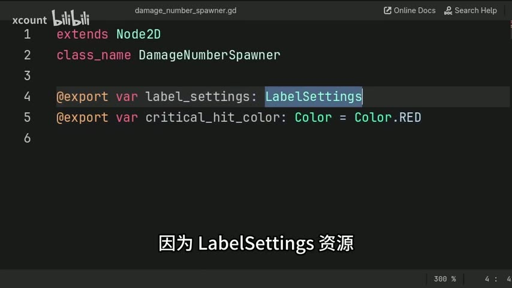

- `label_settings` 持有 `LabelSettings` 资源，包含字体、字号、字色、描边等属性。
- `critical_hit_color` 是暴击时的字体颜色，默认红色。你可以使用 `Color.RED` 或十六进制字符串 `Color("FF0000")`——用字符串的好处是在检查器中可以直接点击颜色选择器。

*为什么用 @export*：每个敌人的 DamageNumberSpawner 实例可以配置不同的外观，比如玩家受伤和敌人受伤可以用不同颜色。

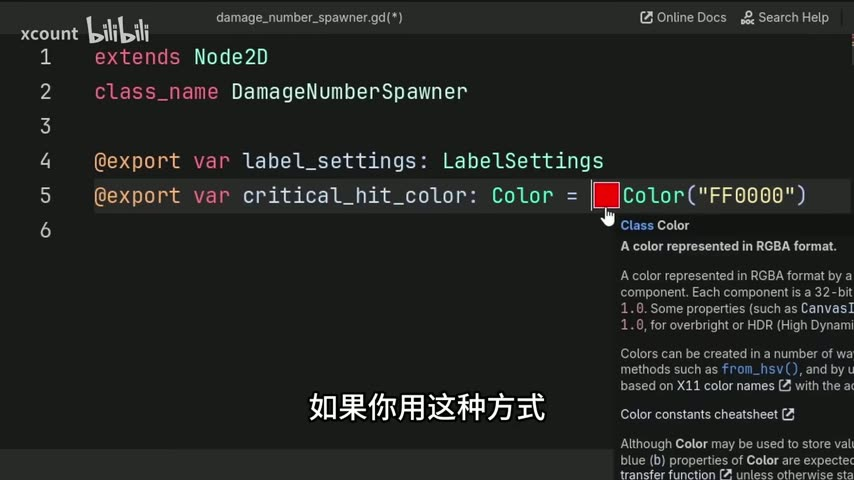

---

## 3. 定义 spawn_label 函数

[01:30] **函数签名**

```gdscript
func spawn_label(number: float, critical_hit: bool = false) -> void:
```

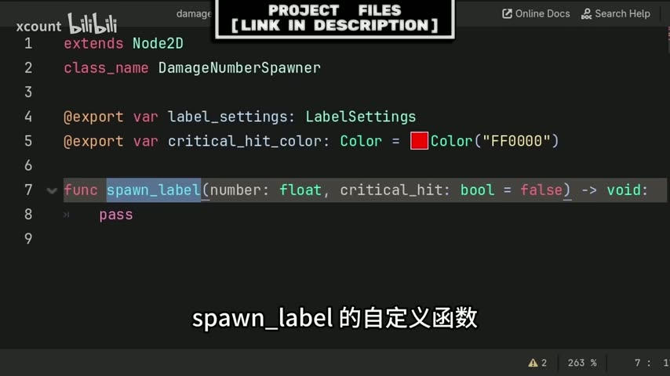

- `number`：要显示的伤害数值。
- `critical_hit`：是否暴击，默认 `false`。对于不会受到暴击的敌人，调用时只传 `number` 即可。

---

## 4. 创建 Label 并设置属性

[01:49] **创建 Label 节点并配置文本、样式、层级**

```gdscript
    var new_label: Label = Label.new()

    new_label.text = str(number if step_decimals(number) != 0 else number as int)
    new_label.label_settings = label_settings.duplicate()
    new_label.z_index = 1000
    new_label.pivot_offset_ratio = Vector2(0.5, 1.0)
```

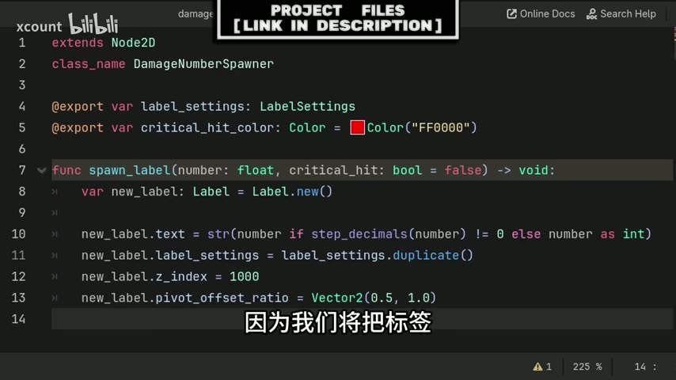

逐行说明：

| 行 | 作用 |
|---|------|
| `Label.new()` | 在代码中动态创建一个 Label 节点 |
| `str(...)` | 将数字转成字符串显示。`step_decimals(number)` 返回小数位数——如果为 0（如 10.0），就转成 `int` 显示 `10` 而不是 `10.0` |
| `label_settings.duplicate()` | 复制一份 LabelSettings，避免修改暴击颜色时影响所有 Label |
| `z_index = 1000` | 确保伤害数字显示在所有游戏内容之上 |
| `pivot_offset_ratio = Vector2(0.5, 1.0)` | 缩放动画的原点设在 Label 底部中央 |

---

## 5. 暴击变色

[03:15] **根据 critical_hit 参数修改字体颜色**

```gdscript
    if critical_hit:
        new_label.label_settings.font_color = critical_hit_color
```

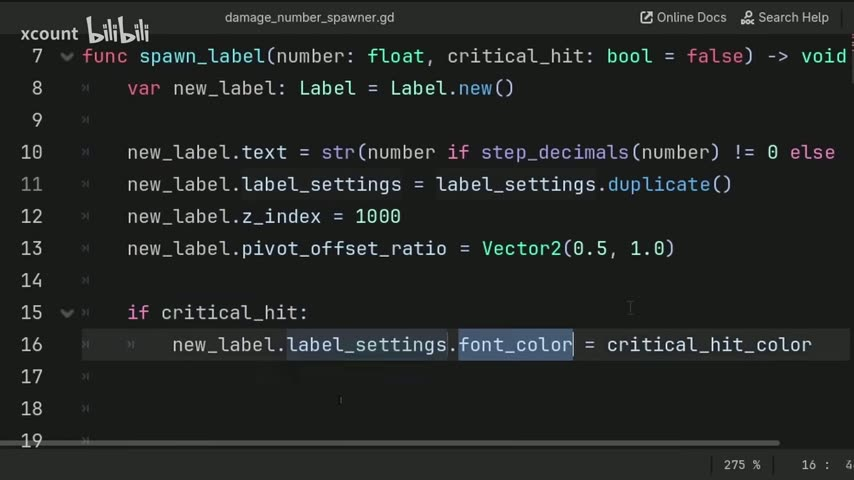

注意：这里修改的是 `new_label.label_settings`（已经 duplicate 过的副本），而不是导出变量 `label_settings` 本身。

---

## 6. 可选：忽略 2D 光照

[03:28] **让伤害数字不受场景中 2D 光照影响（可选）**

```gdscript
    var label_material: CanvasItemMaterial = CanvasItemMaterial.new()
    label_material.light_mode = CanvasItemMaterial.LIGHT_MODE_UNSHADED
    new_label.material = label_material
```

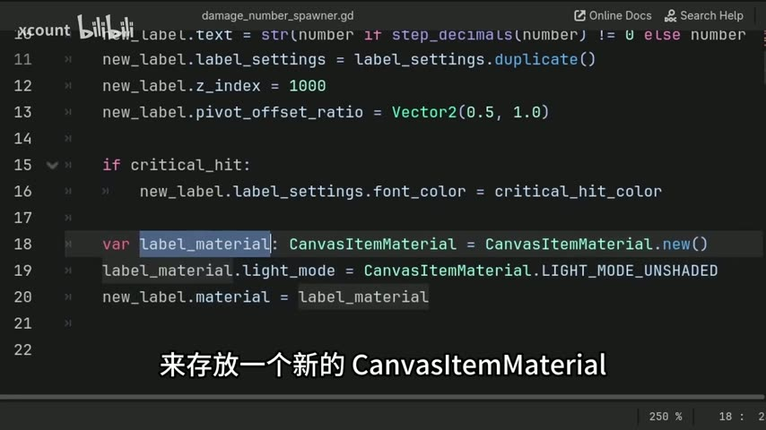

如果你的游戏没有 2D 光照节点，可以跳过这部分。

---

## 7. 添加 Label 到场景 + 位置对齐

[03:48] **使用 call_deferred 添加子节点并等待 resized 信号**

```gdscript
    call_deferred("add_child", new_label)
    await new_label.resized
    new_label.position -= Vector2(new_label.size.x / 2.0, new_label.size.y)
```

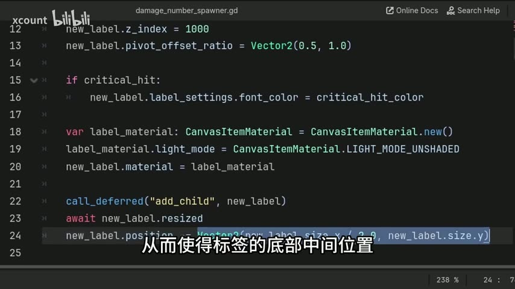

- `call_deferred` 将 `add_child` 推迟到当前帧末尾执行，确保执行顺序正确，避免潜在错误。
- `await new_label.resized` 等待 Label 因文本内容变化而触发的 `resized` 信号，此时才能获取正确的 `size`。
- 位置偏移使 Label 的底部中心对齐到 Spawner 的 (0, 0) 位置。

---

## 8. 可选：随机偏移生成位置

[04:15] **给生成位置添加轻微随机偏移**

```gdscript
    new_label.position += Vector2(randf_range(-5.0, 5.0), randf_range(-5.0, 5.0))
```

这样多个伤害数字同时出现时不会完全重叠。

---

## 9. Tween 动画：上浮 + 放大 + 淡出

[04:24] **定义动画参数**

```gdscript
    var target_rise_pos: Vector2 = new_label.position + Vector2(randf_range(-5.0, 5.0), randf_range(-22.0, -16.0))
    var tween_length: float = 0.92
```

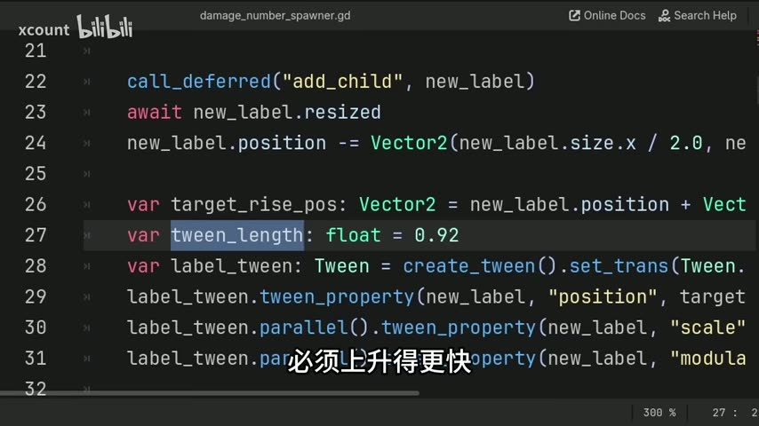

- `target_rise_pos`：Label 上浮的目标位置。Y 方向取 -22 到 -16 的随机值（向上移动），X 方向也有轻微随机，让不同数字的飘动轨迹有差异。
- `tween_length`：动画总时长 0.92 秒。由于目标高度随机但时间固定，目标更高的数字看起来会上升更快。

[05:07] **创建 Tween 并设置缓动**

```gdscript
    var label_tween: Tween = create_tween().set_trans(Tween.TRANS_BACK).set_ease(Tween.EASE_OUT)
```

- `TRANS_BACK` + `EASE_OUT` 产生一个先微微过冲再回弹的平滑动画效果。

[05:32] **三个并行的 tween_property 调用**

```gdscript
    label_tween.tween_property(new_label, "position", target_rise_pos, tween_length)
    label_tween.parallel().tween_property(new_label, "scale", Vector2.ONE * 1.35, tween_length)
    label_tween.parallel().tween_property(new_label, "modulate:a", 0.0, tween_length).connect("finished", new_label.queue_free)
```

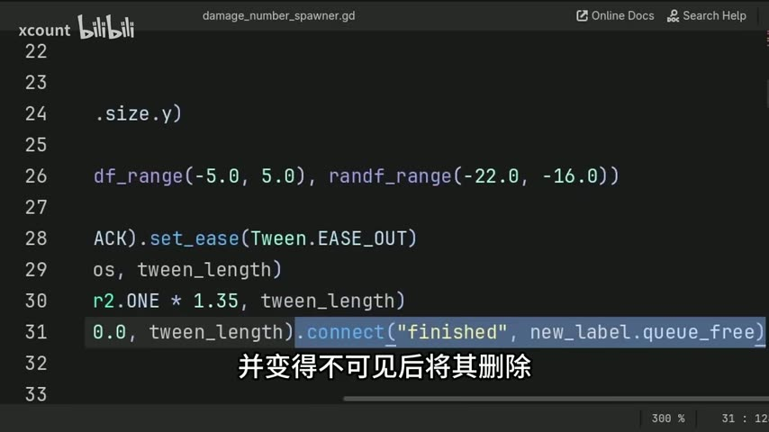

| Tween 属性 | 目标值 | 效果 |
|-----------|-------|------|
| `position` | `target_rise_pos` | 数字上浮 |
| `scale` | `Vector2.ONE * 1.35` | 数字略微放大到 135% |
| `modulate:a` | `0.0` | 透明度归零，淡出消失 |

注意要点：
- `parallel()` 使后两个 tween_property 与第一个同时执行（默认是顺序执行）。
- 在字符串路径中使用冒号 `:` 而非点 `.`（`"modulate:a"` 而不是 `"modulate.a"`）。
- `.connect("finished", new_label.queue_free)` 在 Tween 完成后自动删除 Label 节点，防止内存泄漏。

---

## 10. 将 DamageNumberSpawner 添加到敌人

[06:49] **在敌人场景中添加自定义节点**

打开敌人场景，点击 "+" 添加节点，搜索 `DamageNumberSpawner`，点击 Create。

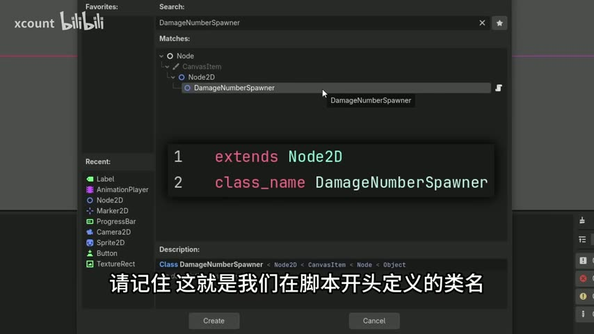

如果搜索不到，检查 `class_name` 拼写是否正确，或者保存项目后重启 Godot。

[07:07] **调整节点位置和导出属性**

将 DamageNumberSpawner 节点拖动到希望数字出现的位置（例如敌人头顶）。在检查器中：

1. 设置 `Critical Hit Color`（暴击颜色）。
2. 点击 `Label Settings` 旁的空值，选择 New LabelSettings，设置字体、字号、描边等。

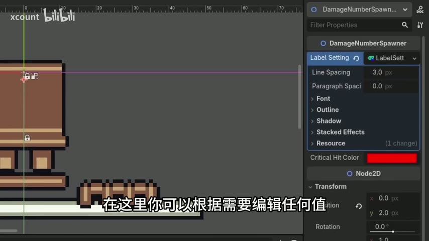

*复用技巧*：设置好 LabelSettings 后，点击下拉菜单选择 Save As，保存为 `damage_label_basic.tres`。之后在其他敌人上可以直接加载这个资源文件。如果需要微调某个敌人的样式，加载后选择 Make Unique 再修改。

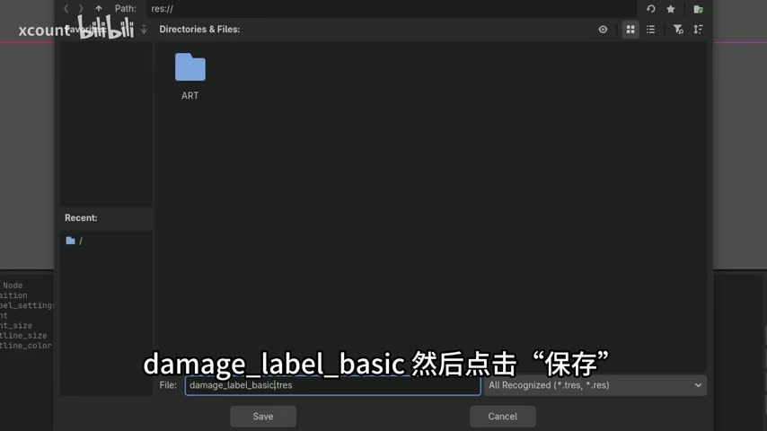

---

## 11. 在敌人脚本中调用

[08:03] **调用 spawn_label 生成伤害数字**

在敌人脚本（如 `enemy.gd`）中，获取 DamageNumberSpawner 节点并调用 `spawn_label`：

```gdscript
$DamageNumberSpawner.spawn_label(damage, critical_hit)
```

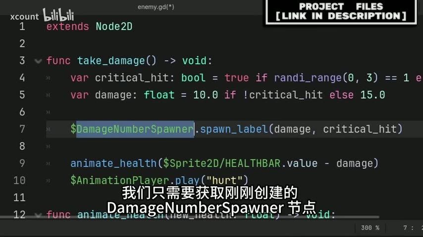

如果敌人不会受到暴击，可以只传伤害值：

```gdscript
$DamageNumberSpawner.spawn_label(damage)
```

Godot 会使用 `critical_hit` 参数的默认值 `false`。

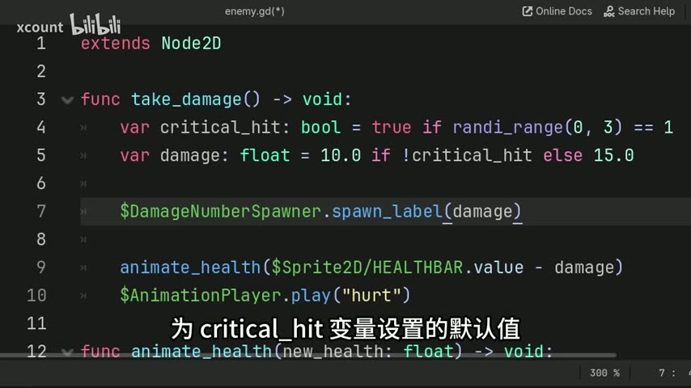

---

## 最终效果

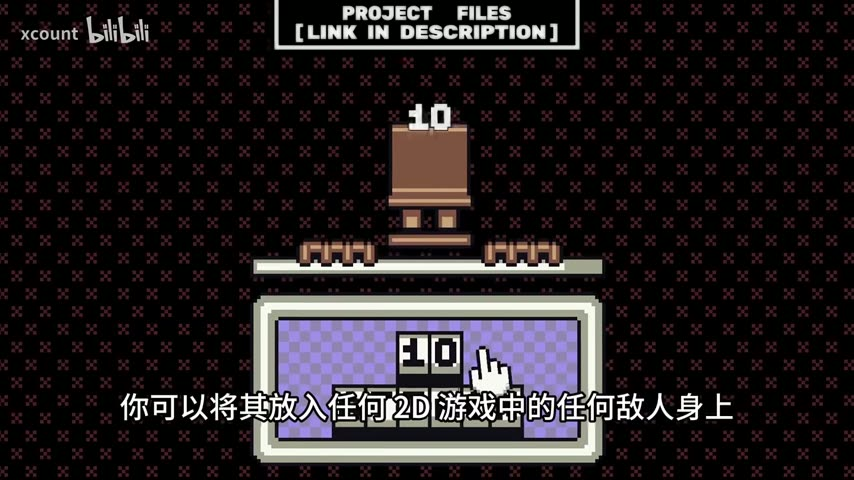

伤害数字从敌人头顶生成，随机漂浮上升并放大、淡出消失。暴击时字体变为红色（或你自定义的颜色）。

---

## 完整代码

### damage_number_spawner.gd

```gdscript
extends Node2D
class_name DamageNumberSpawner

@export var label_settings: LabelSettings
@export var critical_hit_color: Color = Color("FF0000")

func spawn_label(number: float, critical_hit: bool = false) -> void:
    var new_label: Label = Label.new()

    new_label.text = str(number if step_decimals(number) != 0 else number as int)
    new_label.label_settings = label_settings.duplicate()
    new_label.z_index = 1000
    new_label.pivot_offset_ratio = Vector2(0.5, 1.0)

    if critical_hit:
        new_label.label_settings.font_color = critical_hit_color

    # 可选：忽略 2D 光照
    var label_material: CanvasItemMaterial = CanvasItemMaterial.new()
    label_material.light_mode = CanvasItemMaterial.LIGHT_MODE_UNSHADED
    new_label.material = label_material

    call_deferred("add_child", new_label)
    await new_label.resized
    new_label.position -= Vector2(new_label.size.x / 2.0, new_label.size.y)
    new_label.position += Vector2(randf_range(-5.0, 5.0), randf_range(-5.0, 5.0))

    var target_rise_pos: Vector2 = new_label.position + Vector2(randf_range(-5.0, 5.0), randf_range(-22.0, -16.0))
    var tween_length: float = 0.92
    var label_tween: Tween = create_tween().set_trans(Tween.TRANS_BACK).set_ease(Tween.EASE_OUT)
    label_tween.tween_property(new_label, "position", target_rise_pos, tween_length)
    label_tween.parallel().tween_property(new_label, "scale", Vector2.ONE * 1.35, tween_length)
    label_tween.parallel().tween_property(new_label, "modulate:a", 0.0, tween_length).connect("finished", new_label.queue_free)
```

### enemy.gd（调用示例）

```gdscript
extends Node2D

func take_damage() -> void:
    var critical_hit: bool = true if randi_range(0, 3) == 1 else false
    var damage: float = 10.0 if !critical_hit else 15.0

    $DamageNumberSpawner.spawn_label(damage, critical_hit)

    # 你的其他受伤逻辑...
```
