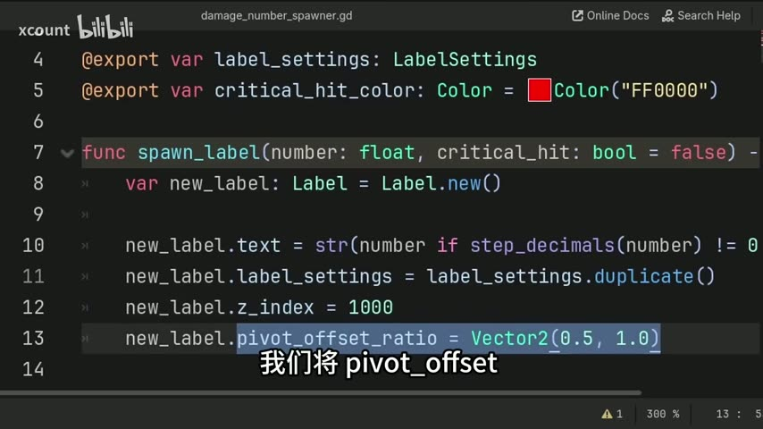
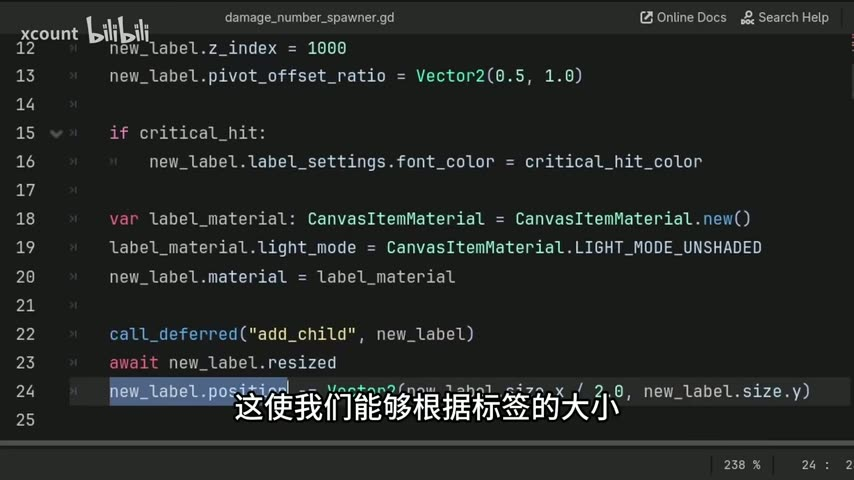
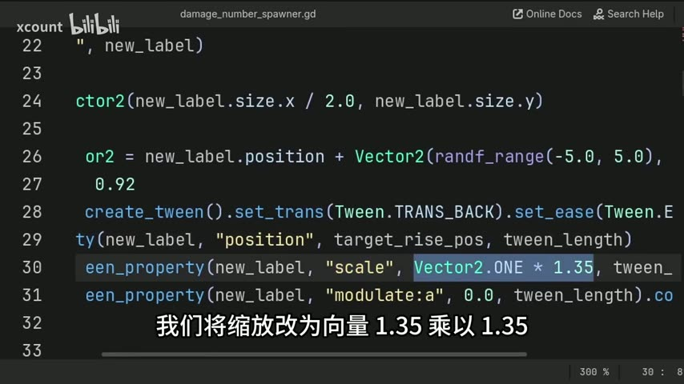
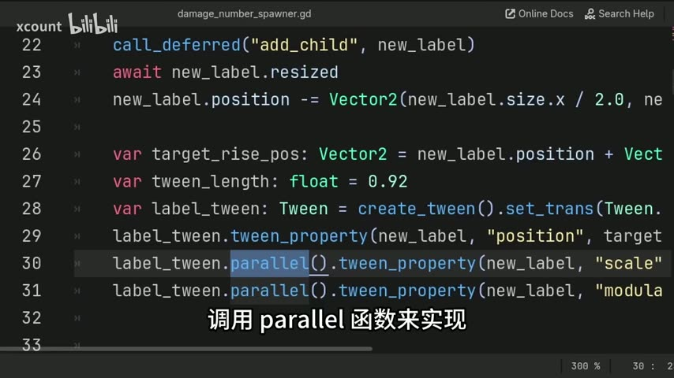
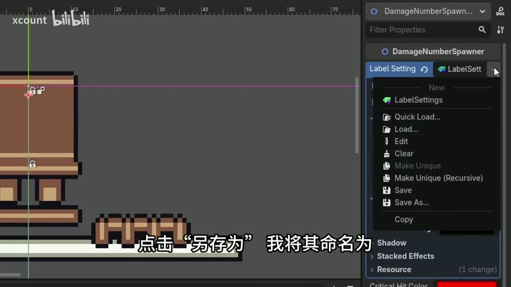
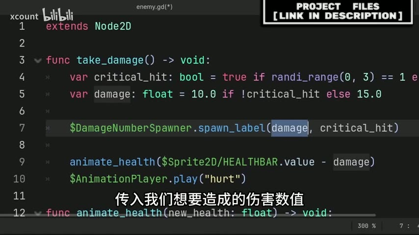

# 【Godot教程】伤害数字生成器：暴击变色、随机漂浮、可复用，一看就会

> UP主: xcount | 时长: 08:40 | 原视频: https://www.bilibili.com/video/BV1C9QCBdE1U

## 这个教程做什么

创建一个可复用的 **DamageNumberSpawner** 自定义节点：把它挂到任何敌人身上，调用一个函数就能弹出带动画的伤害数字，支持暴击变色、随机漂浮方向、自动消失。

## 目录

1. [下载资源 & 创建脚本](#s1)
2. [定义类名和导出变量](#s2)
3. [编写 spawn_label 函数：创建标签](#s3)
4. [处理暴击颜色和灯光](#s4)
5. [添加漂浮动画](#s5)
6. [在敌人场景中使用](#s6)

---

<a id="s1"></a>
## 1. 下载资源 & 创建脚本

[00:00] 视频描述中有免费的项目资源文件可以下载。


[00:06] 我们的目标是创建一个**自定义节点**，它像任何内置节点一样可以通过 Add Node 窗口添加到场景中，节点内包含生成伤害数字标签的全部逻辑。

[00:12] 打开 Godot，进入 **Scripts** 选项卡 → **File** → **New Script**，将脚本命名为 `damage_number_spawner`，点击 **Create**。

---

<a id="s2"></a>
## 2. 定义类名和导出变量

[00:18] 在脚本开头，确保扩展自 `Node2D`。

*为什么用 Node2D？* 因为我们需要它的 `position` 属性——当你把这个自定义节点添加到敌人场景后，它继承了 Node2D 的所有变换属性，你可以用位置来控制数字出现的位置。


[00:29] 定义 `class_name DamageNumberSpawner`。这会把脚本注册为一个节点类型，出现在 Add Node 窗口中，你搜索这个名字就能找到它。

[00:37] 定义两个 `@export` 变量：


```gdscript
extends Node2D

class_name DamageNumberSpawner

@export var label_settings: LabelSettings
@export var critical_hit_color: Color = Color("FF0000")
```

- **`label_settings: LabelSettings`** — 存放标签的全部外观设置（字体、大小、颜色、轮廓等），`LabelSettings` 是 Godot 内置资源类型。
- **`critical_hit_color: Color`** — 暴击时文字的颜色，默认红色。你可以用 `Color("FF0000")` 十六进制写法，也可以用 `Color.RED` 这种颜色名。

[01:08] *为什么用 @export？* 因为每个敌人可以有不同的标签样式。比如对手打你的伤害用蓝色，你打对手用红色——通过 export 变量在编辑器里直接配置，不用改代码。

---

<a id="s3"></a>
## 3. 编写 spawn_label 函数：创建标签

[01:30] 创建函数 `spawn_label`，两个参数：


```gdscript
func spawn_label(number: float, critical_hit: bool = false) -> void:
    var new_label: Label = Label.new()
```

- **`number: float`** — 要显示的伤害值
- **`critical_hit: bool = false`** — 是否暴击，默认 false。这意味着不能暴击的敌人调用时只需传 `number`，不用管第二个参数。

[01:53] 设置标签文本：

```gdscript
    new_label.text = str(number if step_decimals(number) != 0 else int(number))
```

*为什么用 `step_decimals`？* `step_decimals(10.0)` 返回 `0`（没有非零小数位），`step_decimals(10.5)` 返回 `1`。这样 `10.0` 显示为 `10` 而不是 `10.0`，更干净。

[02:27] 设置其他标签属性：



```gdscript
    new_label.label_settings = label_settings.duplicate()
    new_label.z_index = 1000
    new_label.pivot_offset_ratio = Vector2(0.5, 1.0)
```

- **`label_settings.duplicate()`** — 复制一份，这样改暴击颜色时不会影响其他标签。
- **`z_index = 1000`** — 确保标签显示在所有游戏元素之上。根据你的项目调整这个数字。
- **`pivot_offset_ratio = Vector2(0.5, 1.0)`** — 把缩放原点设在标签底部中心，这样后面做放大动画时效果更自然。

---

<a id="s4"></a>
## 4. 处理暴击颜色和灯光

[03:15] 如果是暴击，修改字体颜色：

```gdscript
    if critical_hit:
        new_label.label_settings.font_color = critical_hit_color
```

**注意**：改的是 `new_label.label_settings`（标签的副本），不是 `label_settings`（export 变量本体）。

[03:24] （可选）如果游戏有 2D 灯光效果，标签可能被灯光影响。如果不想要这个效果：



```gdscript
    var label_material: CanvasItemMaterial = CanvasItemMaterial.new()
    label_material.light_mode = CanvasItemMaterial.LIGHT_MODE_UNSHADED
    new_label.material = label_material
```

这会让标签忽略所有 2D 灯光和阴影。**这部分完全可选**，没有 2D 灯光的游戏不需要。

[03:45] 将标签添加到场景，然后调整位置让底部中心对齐 spawner 的原点：

```gdscript
    call_deferred("add_child", new_label)
    await new_label.resized
    new_label.position -= Vector2(new_label.size.x / 2.0, new_label.size.y)
```

*为什么用 `call_deferred`？* 在当前帧末尾添加子节点，这样可以安全地 `await resized` 信号——标签的 `text` 设置后会触发 `resized`，我们根据实际尺寸计算偏移，确保底部中心对齐 spawner 位置。

[04:12] （可选）给初始位置加随机偏移，让多个数字不重叠：

```gdscript
    new_label.position += Vector2(randf_range(-5.0, 5.0), randf_range(-5.0, 5.0))
```

---

<a id="s5"></a>
## 5. 添加漂浮动画

[04:20] 定义三个动画变量：

```gdscript
    var target_rise_pos: Vector2 = new_label.position + Vector2(
        randf_range(-5.0, 5.0), randf_range(-22.0, -16.0)
    )
    var tween_length: float = 0.92
    var label_tween: Tween = create_tween().set_trans(Tween.TRANS_BACK).set_ease(Tween.EASE_OUT)
```

- **`target_rise_pos`** — 标签要飘到的位置。Y 方向随机 -22 到 -16（向上飘），X 方向 ±5（轻微左右晃动），每个数字飘的方向都不同。
- **`tween_length = 0.92`** — 动画总时长。因为时长固定但距离不同，飘得远的看起来会更快。
- **Tween 设置** — `TRANS_BACK` + `EASE_OUT` 让动画有弹性回弹效果。

[05:32] 同时运行三个 tween 动画：



```gdscript
    label_tween.tween_property(new_label, "position", target_rise_pos, tween_length)
    label_tween.parallel().tween_property(new_label, "scale", Vector2.ONE * 1.35, tween_length)
    label_tween.parallel().tween_property(new_label, "modulate:a", 0.0, tween_length)
```



- **位置**：向上飘到 `target_rise_pos`
- **缩放**：放大到 1.35 倍
- **透明度**：`modulate:a` 从 1.0 渐变到 0.0（完全透明）

**注意**：属性路径用冒号（`modulate:a`），不是点号。第二和第三个动画前加 `.parallel()`，告诉 Godot 和第一个同时运行。

[06:27] 动画结束后自动删除节点：

```gdscript
    label_tween.finished.connect(new_label.queue_free)
```

连接 tween 的 `finished` 信号到 `queue_free`，标签透明后自动删除自己。

---

<a id="s6"></a>
## 6. 在敌人场景中使用

[06:46] 打开任意敌人场景，按 **+** 添加节点，搜索 `DamageNumberSpawner`。



[07:07] 添加后，调整节点位置（比如 Y 轴 -2，让数字从敌人头顶出现）。

[07:13] 在 Inspector 中配置 export 变量：
- **Critical Hit Color** — 设置暴击颜色
- **Label Settings** — 点击空白处 → 选择 **New LabelSettings** → 设置字体、大小、轮廓等

[07:33] **复用技巧**：配好一个 LabelSettings 后，点击下拉菜单 → **Save As...** 保存为资源文件（比如 `damage_label_basic.tres`）。以后新敌人直接 **Load** 这个文件就行。如果某个敌人要微调，先 Load 再 **Make Unique** 就能独立修改而不影响原文件。

[07:59] 在敌人脚本中调用：



```gdscript
func take_damage() -> void:
    var critical_hit: bool = true if randi_range(0, 3) == 1 else false
    var damage: float = 10.0 if !critical_hit else 15.0

    $DamageNumberSpawner.spawn_label(damage, critical_hit)

    animate_health($Sprite2D/HEALTHBAR.value - damage)
    $AnimationPlayer.play("hurt")
```

只需要一行 `$DamageNumberSpawner.spawn_label(damage, critical_hit)` 就搞定了。如果敌人不能暴击，只传数字即可：`$DamageNumberSpawner.spawn_label(damage)`。

---

## 完整代码

### damage_number_spawner.gd

```gdscript
extends Node2D

class_name DamageNumberSpawner

@export var label_settings: LabelSettings
@export var critical_hit_color: Color = Color("FF0000")


func spawn_label(number: float, critical_hit: bool = false) -> void:
    var new_label: Label = Label.new()

    new_label.text = str(number if step_decimals(number) != 0 else int(number))
    new_label.label_settings = label_settings.duplicate()
    new_label.z_index = 1000
    new_label.pivot_offset_ratio = Vector2(0.5, 1.0)

    if critical_hit:
        new_label.label_settings.font_color = critical_hit_color

    # (可选) 忽略 2D 灯光
    var label_material: CanvasItemMaterial = CanvasItemMaterial.new()
    label_material.light_mode = CanvasItemMaterial.LIGHT_MODE_UNSHADED
    new_label.material = label_material

    call_deferred("add_child", new_label)
    await new_label.resized
    new_label.position -= Vector2(new_label.size.x / 2.0, new_label.size.y)
    new_label.position += Vector2(randf_range(-5.0, 5.0), randf_range(-5.0, 5.0))

    var target_rise_pos: Vector2 = new_label.position + Vector2(
        randf_range(-5.0, 5.0), randf_range(-22.0, -16.0)
    )
    var tween_length: float = 0.92
    var label_tween: Tween = create_tween().set_trans(Tween.TRANS_BACK).set_ease(Tween.EASE_OUT)

    label_tween.tween_property(new_label, "position", target_rise_pos, tween_length)
    label_tween.parallel().tween_property(new_label, "scale", Vector2.ONE * 1.35, tween_length)
    label_tween.parallel().tween_property(new_label, "modulate:a", 0.0, tween_length)

    label_tween.finished.connect(new_label.queue_free)
```

### 敌人脚本调用示例 (enemy.gd)

```gdscript
$DamageNumberSpawner.spawn_label(damage, critical_hit)
# 不能暴击的敌人:
$DamageNumberSpawner.spawn_label(damage)
```
